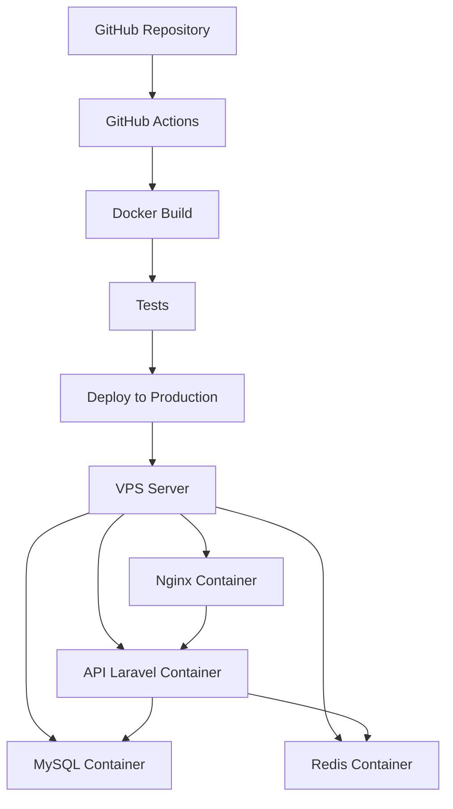

# 🚀 CI/CD Condy API

Este documento descreve a implementação completa de CI/CD para a API Condy, incluindo containers Docker, testes automatizados e deploy automático.

## 📋 Índice

- [Arquitetura](#-arquitetura)
- [Containers Docker](#-containers-docker)
- [CI/CD Pipeline](#-cicd-pipeline)
- [Deploy](#-deploy)
- [Monitoramento](#-monitoramento)
- [Troubleshooting](#-troubleshooting)

## 🏗️ Arquitetura



## 🐳 Containers Docker

### **API Laravel** (`docker/api/Dockerfile`)
- **Base**: `php:8.2-fpm`
- **Extensões**: PDO, MySQL, SQLite, GD, Zip, etc.
- **Composer**: Instalação otimizada
- **Permissões**: Configuradas para www-data
- **Script**: Inicialização automática com migrações

### **Nginx** (`docker/nginx/Dockerfile`)
- **Base**: `nginx:alpine`
- **Configuração**: Otimizada para Laravel
- **Security Headers**: HTTPS, XSS, CSRF
- **Compression**: Gzip habilitado
- **Cache**: Assets estáticos

### **Frontend Vue** (`docker/frontend/Dockerfile`)
- **Build Stage**: `node:18-alpine`
- **Production**: `nginx:alpine`
- **SPA**: Configuração para Single Page Application
- **Proxy**: API proxy para desenvolvimento

### **Database** (MySQL 8.0)
- **Persistent Storage**: Volume mapeado
- **Backup**: Automático via container
- **Health Check**: Configurado

### **Redis** (Alpine)
- **Cache**: Sessões e cache da aplicação
- **Persistent**: AOF habilitado
- **Password**: Protegido

## 🔄 CI/CD Pipeline

### **1. Testes Automatizados** (`.github/workflows/test.yml`)

#### **Triggers:**
- Pull Requests para `main` e `develop`
- Push para `main` e `develop`

#### **Jobs:**

**🧪 Tests**
- Matrix: PHP 8.2, 8.3 x Laravel 11.*
- Database: SQLite em memória
- Coverage: xdebug + Codecov
- Cache: Composer dependencies

**🎨 Code Quality**
- Laravel Pint (Code Style)
- PHPStan (Static Analysis)
- Security Audit

**🐳 Docker Build Test**
- Build de todas as imagens
- Test de containers
- Cache otimizado

### **2. Deploy Automático** (`.github/workflows/deploy.yml`)

#### **Trigger:**
- Push para `main`
- Manual dispatch

#### **Jobs:**

**🧪 Pre-Deploy Tests**
- Executa suite completa de testes
- Falha = cancela deploy

**🔨 Build & Push**
- Build das imagens Docker
- Push para GitHub Container Registry
- Tagging automático (latest, SHA, branch)

**🚀 Deploy**
- SSH para servidor de produção
- Download das novas imagens
- Backup automático do banco
- Rolling deployment
- Health check
- Rollback automático em falha

**📢 Notification**
- Slack notification
- Status de sucesso/falha
- Informações do commit

## 🎯 Deploy

### **Desenvolvimento Local**

```bash
# Clonar repositório
git clone https://github.com/seu-usuario/condy-backend.git
cd condy-backend

# Iniciar containers
docker compose up -d

# API disponível em: http://localhost:8000
# Frontend disponível em: http://localhost:3000 (quando implementado)
```

### **Produção Automática**

1. **Configurar Secrets no GitHub:**
```yaml
PRODUCTION_HOST: "ip-do-servidor"
PRODUCTION_USER: "usuario-ssh"
PRODUCTION_SSH_KEY: "chave-privada-ssh"
PRODUCTION_PORT: "22"
SLACK_WEBHOOK_URL: "webhook-slack" # Opcional
```

2. **Fazer commit na main:**
```bash
git checkout main
git add .
git commit -m "feat: nova funcionalidade"
git push origin main
```

3. **Deploy automático executado!** ✅

### **Deploy Manual de Emergência**

```bash
# No servidor de produção
sudo ./scripts/deploy.sh main

# Ou uma tag específica
sudo ./scripts/deploy.sh v1.2.0
```

## 📊 Monitoramento

### **Health Checks**
- **API**: `GET /up` (Laravel)
- **Nginx**: `curl localhost`
- **MySQL**: `mysqladmin ping`
- **Redis**: `redis-cli ping`

### **Logs**
```bash
# Logs da aplicação
docker compose -f docker-compose.prod.yml logs -f api

# Logs do Nginx
docker compose -f docker-compose.prod.yml logs -f nginx

# Logs de todos os containers
docker compose -f docker-compose.prod.yml logs -f
```

### **Backup Automático**
- **Frequência**: Diário
- **Retenção**: 7 dias
- **Localização**: `/opt/condy/backups/`
- **Compressão**: Gzip

```bash
# Verificar backups
ls -la /opt/condy/backups/

# Restaurar backup
gunzip backup.sql.gz
mysql -u root -p condy_production < backup.sql
```

## 🔧 Configuração do Servidor

### **Requisitos Mínimos**
- **CPU**: 2 cores
- **RAM**: 4GB
- **Storage**: 50GB SSD
- **OS**: Ubuntu 20.04+
- **Docker**: 20.10+
- **Docker Compose**: 2.0+

### **Setup Inicial**

```bash
# 1. Instalar Docker
curl -fsSL https://get.docker.com -o get-docker.sh
sh get-docker.sh

# 2. Instalar Docker Compose
sudo curl -L "https://github.com/docker/compose/releases/latest/download/docker-compose-$(uname -s)-$(uname -m)" -o /usr/local/bin/docker-compose
sudo chmod +x /usr/local/bin/docker-compose

# 3. Configurar usuário Docker
sudo usermod -aG docker $USER

# 4. Criar diretórios
sudo mkdir -p /opt/condy
sudo chown $USER:$USER /opt/condy

# 5. Configurar SSH para GitHub Actions
ssh-keygen -t ed25519 -f ~/.ssh/github_actions
# Adicionar chave pública ao servidor
# Adicionar chave privada como secret no GitHub
```

### **Variáveis de Ambiente de Produção**

```bash
# Copiar template
cp .env.production /opt/condy/.env

# Configurar valores (IMPORTANTE!)
nano /opt/condy/.env
```

**Principais configurações:**
- `APP_KEY`: Gerar com `php artisan key:generate`
- `DB_PASSWORD`: Senha segura do MySQL
- `REDIS_PASSWORD`: Senha segura do Redis
- `APP_URL`: URL de produção
- `MAIL_*`: Configurações de email

## 🔐 Segurança

### **Secrets Management**
- Senhas em `.env` (não commitado)
- GitHub Secrets para CI/CD
- SSH keys para deploy
- Registry tokens

### **Network Security**
- Containers em rede isolada
- Apenas Nginx exposto (porta 80/443)
- Firewall configurado
- SSL/TLS obrigatório

### **Application Security**
- Security headers no Nginx
- CSRF protection
- Rate limiting
- Input validation
- SQL injection protection

## 🛠️ Troubleshooting

### **Deploy Falha**

```bash
# 1. Verificar logs do GitHub Actions
# 2. Conectar no servidor via SSH
ssh user@servidor

# 3. Verificar containers
docker compose -f /opt/condy/docker-compose.prod.yml ps

# 4. Verificar logs
docker compose -f /opt/condy/docker-compose.prod.yml logs -f

# 5. Restart manual se necessário
docker compose -f /opt/condy/docker-compose.prod.yml restart
```

### **API não responde**

```bash
# Verificar se container está rodando
docker ps | grep condy

# Verificar logs da API
docker logs condy-api-prod

# Verificar configuração do Nginx
docker exec condy-nginx-prod nginx -t

# Testar conectividade interna
docker exec condy-nginx-prod curl api:9000
```

### **Banco de dados com problemas**

```bash
# Verificar se MySQL está rodando
docker exec condy-database-prod mysqladmin ping

# Conectar no MySQL
docker exec -it condy-database-prod mysql -u root -p

# Verificar espaço em disco
df -h

# Restaurar backup se necessário
gunzip backup.sql.gz
docker exec -i condy-database-prod mysql -u root -p condy_production < backup.sql
```

### **Rollback de Emergência**

```bash
# Rollback para versão anterior
cd /opt/condy
sudo ./scripts/deploy.sh tag-anterior

# Ou restaurar backup completo
docker compose -f docker-compose.prod.yml down
# Restaurar volumes/backups
docker compose -f docker-compose.prod.yml up -d
```

## 📞 Suporte

### **Logs de Debug**
- GitHub Actions: Na aba Actions do repositório
- Servidor: `/opt/condy/` e logs do Docker
- Aplicação: `storage/logs/laravel.log`

### **Monitoramento**
- Uptime: Health checks automáticos
- Performance: Docker stats
- Erros: Logs centralizados

### **Contatos**
- DevOps: [seu-email@empresa.com]
- Slack: `#condy-alerts`
- On-call: +55 11 99999-9999

---

## 🎉 Conclusão

Este setup de CI/CD oferece:

✅ **Deploy automático** em cada push para main  
✅ **Testes automatizados** em cada PR  
✅ **Rollback automático** em caso de falha  
✅ **Backup automático** do banco de dados  
✅ **Monitoramento** completo dos containers  
✅ **Segurança** em todas as camadas  
✅ **Escalabilidade** horizontal ready  

O pipeline é **robusto**, **seguro** e **automatizado**, permitindo deploys frequentes com confiança! 🚀 